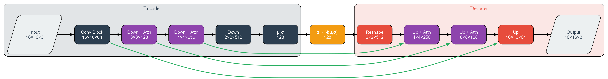

# Lunaris-Orion: Advanced Pixel Art VAE Training System

A sophisticated deep learning system for training Variational Autoencoders (VAE) specialized in pixel art generation and manipulation.



## Features

- **Advanced VAE Architecture**
  - Custom-designed for 16x16 pixel art
  - Self-attention mechanisms for improved detail preservation
  - Residual connections for better gradient flow
  - Configurable latent space dimension
  - Progressive resolution changes through strided convolutions
  - Skip connections for preserving spatial information

- **Robust Training System**
  - Mixed precision training support
  - PyTorch 2.0+ optimizations with `torch.compile`
  - Automatic batch size optimization
  - Dynamic learning rate scheduling with warmup
  - Early stopping with customizable patience
  - Gradient clipping for stability
  - Progressive KL annealing for better convergence

- **Professional Project Structure**
```
output/
├── logs/                    # Training logs with timestamps
├── checkpoints/
│   ├── best/               # Best performing model checkpoints
│   ├── periodic/           # Regular interval checkpoints
│   └── interrupt/          # Checkpoints from interrupted training
├── outputs/
│   ├── samples/            # Generated samples by epoch
│   ├── metrics/            # Training metrics and reports
│   └── comparisons/        # Visual progress comparisons
└── runs/                    # TensorBoard logs
```

## Architecture Overview

The LunarCore VAE consists of three main components:

### 1. Encoder
- Progressive downsampling from 16x16 to 2x2
- Self-attention layers at 8x8 and 4x4 resolutions
- ResNet blocks for feature extraction
- Outputs mean (μ) and log-variance (σ) for the latent space

### 2. Latent Space
- Configurable latent dimension (default: 128)
- Reparameterization trick for backpropagation
- Gaussian prior (N(0,1))
- Progressive KL annealing for better convergence

### 3. Decoder
- Progressive upsampling from 2x2 to 16x16
- Matching self-attention layers
- Skip connections from encoder
- Final tanh activation for normalized output
- Dropout layers for regularization

## Advanced Features

### Checkpoint Management
- Automatic best model preservation
- Periodic checkpoints at configurable intervals
- Interrupt-safe checkpoint system
- Smart cleanup of old checkpoints
- Automatic best checkpoint detection and resume

### Advanced Logging System
- Structured logging with timestamps
- Detailed progress tracking
- Error and warning monitoring
- Training metrics visualization
- Hardware resource monitoring

### Training Reports
- Comprehensive per-epoch metrics
- Hardware utilization statistics
- Training configuration tracking
- Performance metrics (MAE, PSNR)
- JSON-formatted for easy analysis

### Training Artifacts
- Progress visualization grids
- High-quality sample generation
- Detailed metric tracking
- Training progress comparisons

## Requirements

- Python 3.8+
- PyTorch 2.0+
- CUDA-capable GPU (recommended)
- Additional dependencies:
  - torchvision >= 0.17.0
  - numpy >= 1.24.0
  - tensorboard >= 2.14.0
  - tqdm >= 4.65.0
  - pillow >= 10.0.0
  - psutil >= 5.9.0

## Installation

1. Clone the repository:
```bash
git clone https://github.com/MeryylleA/Lunaris-Orion.git
cd Lunaris-Orion
```

2. Create and activate a virtual environment:
```bash
python -m venv .venv
source .venv/bin/activate  # Linux/Mac
# or
.venv\Scripts\activate  # Windows
```

3. Install dependencies:
```bash
pip install -r requirements.txt
```

## Usage

### Hardware-Specific Configurations

#### High-End GPU (e.g., NVIDIA L40S, A100)
```bash
python lunarispixel/train_lunar_core.py \
    --data_dir /path/to/images \
    --output_dir /path/to/output \
    --batch_size 1024 \
    --epochs 500 \
    --learning_rate 0.001 \
    --latent_dim 256 \
    --compile \
    --mixed_precision \
    --save_every 5
```

#### Mid-Range GPU (e.g., RTX 3080, 4080)
```bash
python lunarispixel/train_lunar_core.py \
    --data_dir /path/to/images \
    --output_dir /path/to/output \
    --batch_size 512 \
    --epochs 300 \
    --learning_rate 0.001 \
    --latent_dim 128 \
    --mixed_precision
```

#### Entry-Level GPU (e.g., RTX 3060, 2060)
```bash
python lunarispixel/train_lunar_core.py \
    --data_dir /path/to/images \
    --output_dir /path/to/output \
    --batch_size 256 \
    --epochs 200 \
    --learning_rate 0.001 \
    --latent_dim 64
```

#### CPU-Only (with FP16 support)
```bash
python lunarispixel/train_lunar_core.py \
    --data_dir /path/to/images \
    --output_dir /path/to/output \
    --batch_size 128 \
    --epochs 100 \
    --learning_rate 0.0005 \
    --latent_dim 32
```

### Key Parameters

| Parameter | Description | Default | Notes |
|-----------|-------------|---------|-------|
| epochs | Number of training epochs | 300 | Adjust based on dataset size |
| batch_size | Batch size | 512 | Hardware dependent |
| learning_rate | Initial learning rate | 0.001 | |
| latent_dim | Dimension of latent space | 128 | Higher for more complex datasets |
| kl_weight | Weight of KL divergence loss | 0.0005 | |
| data_dir | Training data directory | "images" | |
| output_dir | Output directory for checkpoints | "output" | |
| save_every | Save checkpoint interval | 10 | |
| lr_step_size | LR scheduler step size | 10 | |
| lr_gamma | LR scheduler gamma | 0.8 | |
| patience | Early stopping patience | 7 | |
| min_delta | Minimum improvement for early stopping | 0.0001 | |
| compile | Use torch.compile optimization | False | Recommended for modern GPUs |
| mixed_precision | Enable mixed precision training | False | Recommended for modern GPUs |

## Training Monitoring

### Real-time Monitoring
- Training progress with tqdm
- Batch-level metrics every 10 batches
- Epoch summaries with comprehensive metrics
- Hardware utilization statistics

### TensorBoard Integration
```bash
tensorboard --logdir path/to/output/runs
```

### Training Reports
- Located in `output/outputs/metrics/`
- Contains detailed per-epoch information
- Hardware utilization history
- Complete training configuration

## Model Architecture Details

The model uses several key components:

- **ResNet Blocks**: Each with Conv3×3, BatchNorm, and Dropout
- **Self-Attention**: Q,K,V transformations for capturing global context
- **Skip Connections**: Preserving spatial information across different scales
- **Mixed Precision Training**: For efficient GPU utilization
- **Training Stability Features**:
  - Gradient value clipping at 1.0
  - Adaptive learning rate with 5-epoch warmup
  - Progressive KL annealing over first 10 epochs
  - Weight decay (1e-4) for regularization
  - Improved numerical stability with epsilon=1e-8

## Results

The model generates high-quality 16x16 pixel art images while maintaining:
- Sharp edges and pixel-perfect details
- Consistent color palettes
- Global structure through attention mechanisms
- Stable training progression
- Controlled latent space distribution

## Contributing

1. Fork the repository
2. Create your feature branch
3. Commit your changes
4. Push to the branch
5. Create a new Pull Request

## License

This project is licensed under the MIT License - see the LICENSE file for details.

## Citation

If you use this code for your research, please cite:

```bibtex
@software{lunaris_orion,
  title = {Lunaris-Orion: Advanced Pixel Art VAE with Self-Attention},
  year = {2025},
  author = {Moon Cloud Services},
  url = {https://github.com/MeryylleA/Lunaris-Orion}
}
```

## Acknowledgments

- Thanks to the PyTorch team for their excellent framework
- Inspired by various VAE architectures and self-attention mechanisms
- Special thanks to the pixel art community for dataset contributions
