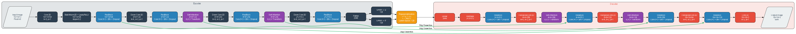

# Lunaris-Orion: Pixel Art VAE with Self-Attention

A Variational Autoencoder (VAE) with self-attention mechanisms designed specifically for pixel art generation and manipulation. This project combines the power of VAEs with modern deep learning techniques to create a robust model for pixel art processing.



## Features

- **High-Quality Pixel Art Generation**: Specialized for 16x16 pixel art images
- **Self-Attention Mechanisms**: Captures long-range dependencies in pixel art patterns
- **Skip Connections**: Preserves fine details through the encoding-decoding process
- **Mixed Precision Training**: Optimized for modern GPUs
- **Flexible Architecture**: Easy to modify and extend

## Architecture Overview

The LunarCore VAE consists of three main components:

### 1. Encoder
- Progressive downsampling from 16x16 to 2x2
- Self-attention layers at 8x8 and 4x4 resolutions
- ResNet blocks for feature extraction
- Outputs mean (μ) and log-variance (σ) for the latent space

### 2. Latent Space
- 128-dimensional latent vectors
- Reparametrization trick for backpropagation
- Gaussian prior (N(0,1))

### 3. Decoder
- Progressive upsampling from 2x2 to 16x16
- Matching self-attention layers
- Skip connections from encoder
- Final tanh activation for normalized output

## Requirements

```bash
pip install -r requirements.txt
```

Main dependencies:
- PyTorch >= 2.0
- torchvision
- numpy
- tensorboard
- tqdm
- pillow

## Quick Start

1. **Setup Environment**
```bash
python -m venv .venv
source .venv/bin/activate  # Linux/Mac
.venv\Scripts\activate     # Windows
pip install -r requirements.txt
```

2. **Prepare Dataset**
- Place your 16x16 pixel art images in the `images` directory
- Supported formats: JPG, JPEG, PNG

3. **Training**
```bash
python train_lunar_core.py --epochs 300 --batch_size 512 --learning_rate 0.001 --latent_dim 128 --kl_weight 0.0005 --data_dir images --output_dir output
```

4. **Monitor Training**
```bash
tensorboard --logdir runs
```

## Training Parameters

| Parameter | Description | Default |
|-----------|-------------|---------|
| epochs | Number of training epochs | 300 |
| batch_size | Batch size | 512 |
| learning_rate | Initial learning rate | 0.001 |
| latent_dim | Dimension of latent space | 128 |
| kl_weight | Weight of KL divergence loss | 0.0005 |
| data_dir | Training data directory | "images" |
| output_dir | Output directory for checkpoints | "output" |
| save_every | Save checkpoint interval | 10 |
| lr_step_size | LR scheduler step size | 10 |
| lr_gamma | LR scheduler gamma | 0.8 |

## Model Architecture Details

The model uses several key components:

- **ResNet Blocks**: Each with Conv3×3, BatchNorm, and Dropout
- **Self-Attention**: Q,K,V transformations for capturing global context
- **Skip Connections**: Preserving spatial information across different scales
- **Mixed Precision Training**: For efficient GPU utilization
- **Progressive Resolution Changes**: Through strided convolutions and transposed convolutions

For more detailed information about the architecture and how to modify it, see [Architecture Documentation](docs/architecture.md).

## Results

The model generates high-quality 16x16 pixel art images while maintaining:
- Sharp edges and pixel-perfect details
- Consistent color palettes
- Global structure through attention mechanisms

## Contributing

Contributions are welcome! Please read our [Contributing Guidelines](docs/CONTRIBUTING.md) first.

## License

This project is licensed under the MIT License - see the [LICENSE](LICENSE) file for details.

## Citation

If you use this code for your research, please cite:

```bibtex
@software{lunaris_orion,
  title = {Lunaris-Orion: Pixel Art VAE with Self-Attention},
  year = {2024},
  author = {Your Name},
  url = {https://github.com/yourusername/lunaris-orion}
}
```

## Acknowledgments

- Thanks to the PyTorch team for their excellent framework
- Inspired by various VAE architectures and self-attention mechanisms
- Special thanks to the pixel art community for dataset contributions 