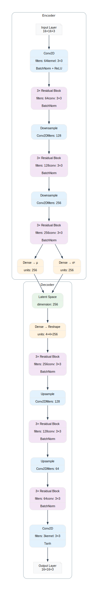

# Lunar Core 🌙

Um modelo VAE (Variational Autoencoder) especializado em geração e reconstrução de pixel art 16x16, implementado em JAX e Flax.

## 🏗️ Arquitetura

<p align="center">
  
</p>

<details>
<summary><strong>Estrutura Detalhada do Modelo</strong></summary>

```
Input (16×16×3) → Encoder
  ├─ Conv2D (64) + BN + ReLU
  ├─ 3× ResBlock (64)
  ├─ DownConv (128)
  ├─ 3× ResBlock (128)
  ├─ DownConv (256)
  ├─ 3× ResBlock (256)
  └─ Dense → Latent (256)
      ↓
Latent Space (256)
      ↓
Dense → Reshape → Decoder
  ├─ 3× ResBlock (256)
  ├─ UpConv (128)
  ├─ 3× ResBlock (128)
  ├─ UpConv (64)
  ├─ 3× ResBlock (64)
  ├─ Conv2D (3) + Tanh
  └─ Output (16×16×3)
```
</details>

### Componentes Principais:
- **Encoder**: Comprime a imagem em um espaço latente de 256 dimensões
- **Decoder**: Reconstrói a imagem a partir do espaço latente
- **Blocos Residuais**: 3 blocos por nível para melhor aprendizado
- **Skip Connections**: Conexões residuais preservam detalhes

## 🌟 Características

- **Arquitetura Especializada**:
  - VAE com blocos residuais otimizados para pixel art
  - Dimensão latente de 256
  - Encoder-Decoder simétrico com 3 níveis de resolução
  - Blocos residuais com normalização em batch

- **Performance**:
  - Treinamento rápido (~173s/epoch em GPU)
  - Suporte a mixed precision (FP16/FP32)
  - Otimizado para GPUs NVIDIA
  - Compatível com CPU

- **Recursos Avançados**:
  - Transfer Learning integrado
  - Data augmentation específico para pixel art
  - Logging com Weights & Biases
  - Checkpoints automáticos

## 🔧 Arquitetura

### Encoder
```
Input (16x16x3)
   ↓
Conv (3x3, 64 filtros) + BatchNorm + ReLU
   ↓
3x ResBlocks (64 filtros)
   ↓
Downsample + Conv (128 filtros)
   ↓
3x ResBlocks (128 filtros)
   ↓
Downsample + Conv (256 filtros)
   ↓
3x ResBlocks (256 filtros)
   ↓
Dense → Latent Space (256 dim)
```

### Decoder
```
Latent Space (256 dim)
   ↓
Dense → Reshape
   ↓
3x ResBlocks (256 filtros)
   ↓
Upsample + Conv (128 filtros)
   ↓
3x ResBlocks (128 filtros)
   ↓
Upsample + Conv (64 filtros)
   ↓
3x ResBlocks (64 filtros)
   ↓
Conv (3x3, 3 filtros) + Tanh
   ↓
Output (16x16x3)
```

## 📊 Resultados

- **Métricas de Treinamento**:
  - Loss inicial: ~0.3864
  - Loss final: ~0.0943
  - Validation Loss: ~0.0849
  - Tempo médio por época: 173s

## 🚀 Instalação

1. Clone o repositório:
```bash
git clone https://github.com/seu-usuario/lunar-core.git
cd lunar-core
```

2. Instale as dependências:
```bash
pip install -r requirements.txt
```

## 💻 Uso

### Treinamento

1. Configure os parâmetros em `config/config.yaml`
2. Execute o treinamento:
```bash
python training/train.py
```

### Inferência

Para gerar novas pixel arts:
```bash
python inference/inference.py
```

## ⚙️ Configuração

O arquivo `config.yaml` permite configurar:

```yaml
model:
  latent_dim: 256
  filters: [64, 128, 256]
  num_residual_blocks: 3
  
training:
  batch_size: 64
  learning_rate: 0.0002
  num_epochs: 100
  
hardware:
  mixed_precision: true
  device_priority: ["gpu", "cpu"]
```

## 📝 Citação

Se você usar este modelo em sua pesquisa, por favor cite:

```bibtex
@software{lunar_core2024,
  title={Lunar Core: A Specialized VAE for Pixel Art Generation},
  author={Seu Nome},
  year={2024},
  publisher={GitHub},
  url={https://github.com/seu-usuario/lunar-core}
}
```

## 📄 Licença

Este projeto está licenciado sob a licença MIT - veja o arquivo [LICENSE](LICENSE) para detalhes.

## 🤝 Contribuição

Contribuições são bem-vindas! Por favor:

1. Fork o projeto
2. Crie sua Feature Branch (`git checkout -b feature/AmazingFeature`)
3. Commit suas mudanças (`git commit -m 'Add some AmazingFeature'`)
4. Push para a Branch (`git push origin feature/AmazingFeature`)
5. Abra um Pull Request

## ✨ Agradecimentos

- JAX Team pela excelente biblioteca
- Comunidade Flax pelos recursos
- Todos os contribuidores 